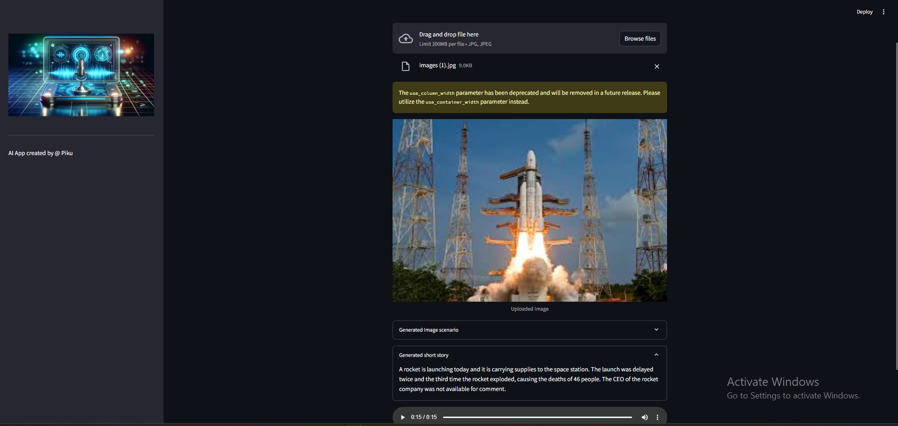

# 🖼️Image-To-Speech-AI-Tool
AI tool that generates an Audio short story based on the context of an uploaded image by prompting a GenAI LLM model, Hugging Face AI models together with Databricks Model

## 📈System Design

## 🏆Approach
An app that uses Hugging Face AI models to generate text from an image, which then generates audio from the text.

Execution is divided into 3 parts:
- **Image to text:**
  an image-to-text transformer model ([Salesforce/blip-image-captioning-base](https://huggingface.co/Salesforce/blip-image-captioning-base)) is used to generate a text scenario based on the on the AI understanding of the image context
- **Text to story:**
  Databricks LLM model is prompted to create a short story (50 words: can be adjusted as reqd.) based on the generated scenario. [dolly-v2-3b](https://huggingface.co/databricks/dolly-v2-3b)
- **Story to speech:**
  a text-to-speech transformer model ([espnet/kan-bayashi_ljspeech_vits](https://huggingface.co/espnet/kan-bayashi_ljspeech_vits)) is used to convert the generated short story into a voice-narrated audio file
- A user interface is built using streamlit to enable uploading the image and playing the audio file

You can listen respective audio file of this test image on respective `img-audio` folder 

## 🌟Requirements

- os
- python-dotenv
- transformers
- torch
- langchain
- requests
- streamlit

  
## 🚀Usage

- Before using the app, the user should have personal tokens for Hugging Face.
- The user should set venv environment and install ipykernel library for running app on local system ide.
- The user should save the personal tokens in an ".env" file within the package as string objects under object names: HUGGINGFACE_TOKEN
- The user can then run the app using the command: streamlit run app.py
- Once the app is running on streamlit, the user can upload the target image
- Execution will start automatically and it may take a few minutes to complete
- Once completed, the app will display:
  - The scenario text generated by the image-to-text transformer HuggingFace model
  - The short story generated by prompting the Databricks LLM
  - The audio file narrating the short story generated by the text-to-speech transformer model
- Deployed Gen AI App on streamlit cloud and Hugging Space

  ## ▶️Installation

Clone the repository:

`git clone https://github.com/picoders1/Image-To-Speech-AI-Tool.git`

Install the required Python packages:

`pip install -r requirements.txt`

Set up your Hugging Face Token by creating a .env file in the root directory of the project with the following contents:

`HUGGINGFACE_API_TOKEN=<<your-access-token-here>`

Run the Streamlit app:

`streamlit run app.py`

## ©️ License

Distributed under the MIT License. See `LICENSE` for more information.

---

#### **If you like this LLM driven Project do drop ⭐ to this repo and Contributions are welcome! If you have any suggestions for improving this AI Img-Speech Converter, please submit a pull request.💁**
#### Follow me on  &nbsp; 

